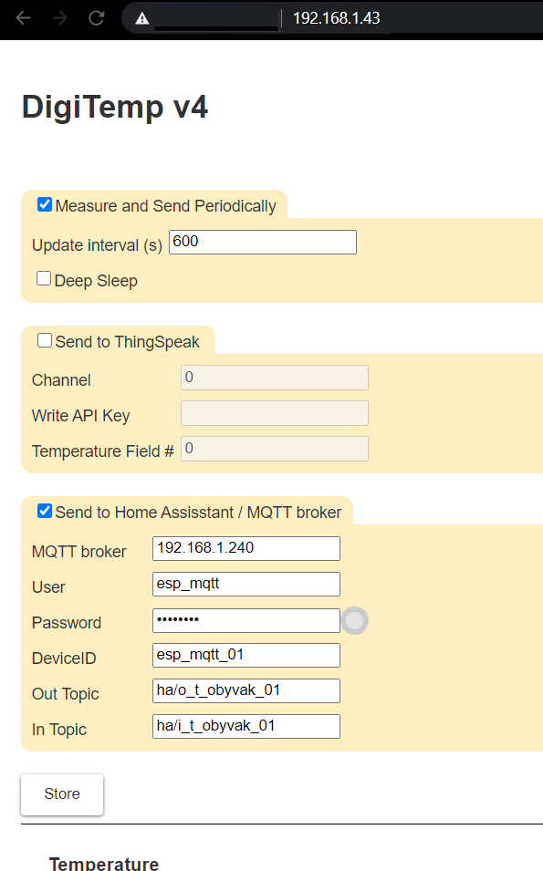

# esp8266-DS18B20-DeepSleep
esp-01, DS18B20, deepsleep, thigspeak

esp01 solution from https://d-beast.cz/domu/25-81-wifi-digitemp-v30-home.html#/26-provedeni-stavebnice_bez_krabicky
* with integration to 
  * ThingSpeak and
  * MQTT / Home Assistatn
* deepsleep functionality (connection gorm GPIO16 to RST needed)
  * customizable (by default dissabled - editable in web settings of the device) 

